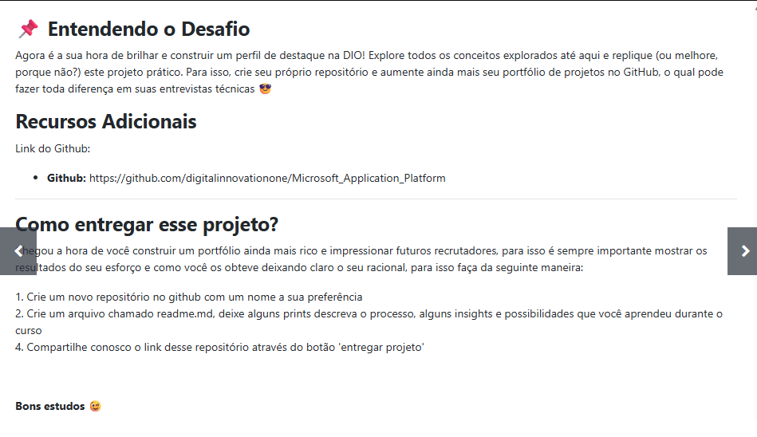
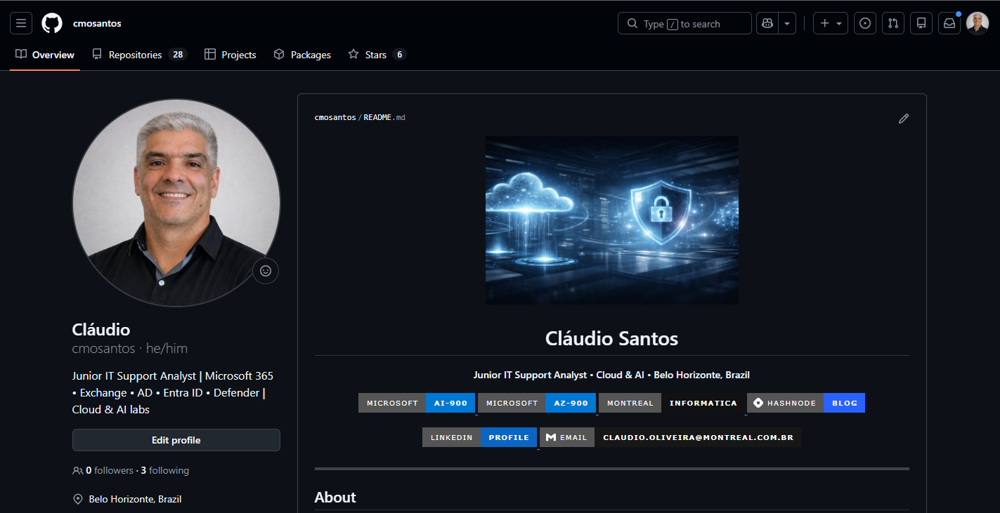
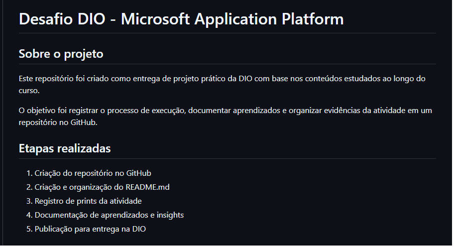

# Desafio DIO - Microsoft Application Platform

## Sobre o projeto

Este repositório foi criado como entrega de projeto prático da DIO com base nos conteúdos estudados ao longo do curso.

O objetivo foi registrar o processo de execução, documentar aprendizados e organizar evidências da atividade em um repositório no GitHub.

## Etapas realizadas

1. Criação do repositório no GitHub
2. Criação e organização do README.md
3. Registro de prints da atividade
4. Documentação de aprendizados e insights
5. Publicação para entrega na DIO

## Evidências (prints)

### Print 1 - Página do desafio na DIO

### Print 2 - Repositório no GitHub

### Print 3 - README no GitHub

## Aprendizados

Este desafio reforçou a importância de praticar os conceitos estudados, documentar o processo e organizar projetos no GitHub de forma clara e profissional.

## Insights e melhorias futuras

Como evolução, posso adicionar mais detalhes técnicos, novas evidências e relacionar o conteúdo estudado com cenários reais de aplicação.

## Conclusão

A atividade contribuiu para consolidar conhecimentos e fortalecer meu portfólio técnico por meio de uma entrega organizada e bem documentada.

## Referência

https://github.com/digitalinnovationone/Microsoft_Application_Platform

## Autor

Cláudio Santos  
GitHub: https://github.com/cmosantos
